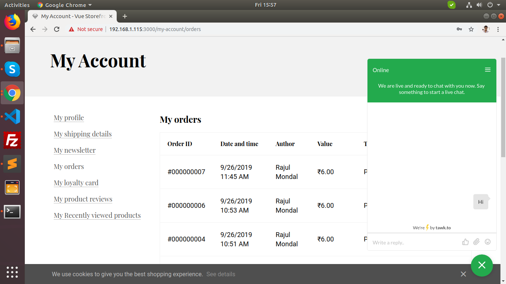

# Vue Storefront tawk.to module
[tawk.to](https://www.tawk.to/) integration for [vue-storefront](https://github.com/DivanteLtd/vue-storefront), by [Rajul Mondal](https://github.com/razzul/).
<br />tawk.to account required (free is available)
<br /><br />
Intergration with the tawk.to customer messaging platform for your Vue Storefront, this tawk.to module is configured to update tawk.to with the customers current route, this allows you to accurately help your customer, knowing what page they are asking questions on from inside tawk.to.
<br /><br />


## Installation:

### 1. Clone the repository

Clone the vsf-tawk repository into your VSF installation.
```shell
$ git clone git@github.com:razzul/vsf-tawk.git vue-storefront/src/modules/tawk
```

### 2. Add the module config to your local VSF configuration file.
Add the following JSON config snippet into your desired config, eg. `config/local.json`
```json
"tawk": {
  "site_id": "{{SITE_ID}}"
}
```
Replace the `site_id` parameter with the Site ID provided by tawk.to. You can find your tawk.to Site ID here: https://dashboard.tawk.to => `Admin` => `Site ID`.
<br />
Valid site_id example: `"site_id": "5d8dd90fdb28311764d623b7"`

### 3. Register the tawk.to module
Open up your `../vue-storefront/src/modules/index.ts` and add the following code. Adding it inside this file the registers the module so it can be used in your Vue Storefront.
<br />
```js
import { Tawk } from './tawk'
...
export const registerModules: VueStorefrontModule[] = [
...
Tawk
...
]
```
### 3. Enjoy!
Thats it! It's easy, plug and play! 
